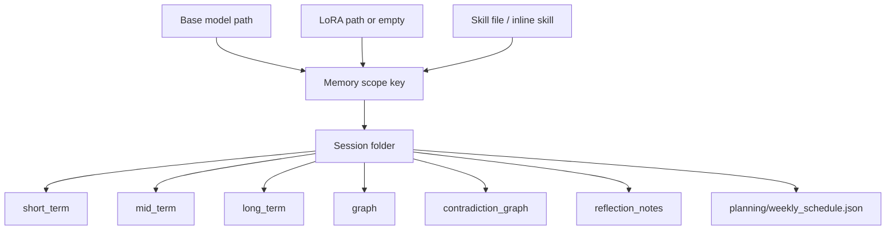

# RoleWeaver 一站式入口设计

日期：2026-04-29

## 目标

RoleWeaver 的入口统一收敛到本地 Web 控制台。用户双击 `start_roleweaver.bat` 后，应能在同一个页面里完成：

- 角色聊天；
- 模型、LoRA、Skill、量化、设备、上下文窗口设置；
- 会话历史、会话命名、记忆整理与记忆编辑；
- 角色日程状态、当前时间地点、每周规划和参考资料检索；
- LoRA 训练；
- LINE Bot 参数编辑；
- LINE Bot 表层策略编辑，包括回复长度、图片提示词、TTS、起床提醒、白天文字优先等。

## 当前实现

当前版本已经改为 Vue 驱动的本地控制台，但不引入在线 CDN：

- `web/index.html`：页面壳；
- `web/app.js`：Vue 应用逻辑、三语文案、页面流程；
- `web/styles.css`：控制台样式；
- `web/vendor/vue.global.prod.js`：本地 vendored Vue 运行文件。

这意味着启动时仍然只需要 `start_roleweaver.bat` 和 FastAPI，不需要用户额外执行前端构建命令。

## 页面信息架构

左侧主导航按用户任务拆分：

| 页面 | 用途 |
| --- | --- |
| 总览 | 运行状态、角色组合、记忆空间、总流程图 |
| 聊天 | 会话、历史、图片输入、手动整理记忆 |
| 角色运行时 | 底模、LoRA、Skill、量化、设备、上下文窗口 |
| 记忆 OS | 记忆列表、状态、矛盾链、生命周期、Memory OS 摘要 |
| Planning | 当前设备时间/地点、角色本周日程、人格锚点、参考资料、临时网络检索 |
| 训练 | Excel/CSV/JSONL LoRA 训练 |
| LINE / TTS / 公网 | LINE bot 启停、临时 Cloudflare URL、Webhook URL、TTS/LINE 参数 |
| 评测 | Persona rule score 和回归测试命令 |
| 流程 | 运行流程与记忆分层流程 |

## 核心流程图

```mermaid
flowchart LR
    A["用户输入<br/>Web / LINE / Image / Voice request"] --> B["Surface Adapter<br/>只改变媒介格式"]
    B --> C["Role Runtime<br/>Base Model + Optional LoRA + SKILL.md"]
    C --> D["Memory Scope<br/>按模型-LoRA-Skill-Session 隔离"]
    D --> E["Memory OS<br/>short / mid / long / graph / reflection / contradiction"]
    E --> P["Planning State<br/>device time / local place / weekly role schedule"]
    P --> Q["Persona Anchor Replay<br/>official/reference-derived calibration"]
    Q --> F["角色回复<br/>Text / LINE / TTS / Image-aware reply"]
```



记忆隔离原则：



## Planning 层

Planning 层不是角色 canon，也不是长期记忆本体。它提供“角色此刻大概在做什么”的生活状态，让角色回复更像生活在同一个时间和地点的人。

当前实现：

- `planning_runtime.py` 读取设备时间、时区和 `ROLEWEAVER_LOCAL_LOCATION`；
- 每个模型-LoRA-Skill 对应的 memory scope 下生成 `planning/weekly_schedule.json`；
- 每周第一次访问自动生成新周计划；
- 用户也可以在 Web 控制台手动重新生成；
- 计划会参考日本 2026 年节假日和日本学校/社团活动资料，再加入确定性扰动事件；
- prompt 注入时明确写明：planning context 不允许覆盖人格和官方设定。
- 如果 `SKILL.md` 旁边存在 `anchors/anchors.jsonl`，Planning 页面也会显示当前选中的人格锚点。

相关接口：

- `GET /planning/{session_id}`：读取当前会话对应角色规划；
- `POST /planning/{session_id}/regenerate`：强制重生成本周规划；
- `GET /planning/search?q=...`：给用户手动查找参考资料，便于后续补强角色日程模型。

## Persona Anchor Replay

Anchor Replay 是 planning 的邻接层：它从官方/验证资料中抽取短片段，用于对抗长对话中的人格退行。它不写入记忆，不伪造成新事件，也不覆盖用户当前任务。

读取位置：

```text
skill/
  SKILL.md
  anchors/
    anchors.jsonl
```

当前美铃示例通过 `resources/anchor_tools/build_gakumas_anchors.py` 从本地 Gakumas ADV 脚本生成。前端 Planning 页面会显示当前 anchor 的标题、摘要、人格维度和来源文件，方便用户确认运行时到底注入了什么。

## 配置边界

LINE Bot 配置分两层：

- `line/.env`：账号密钥、端口、RoleWeaver 配置文件、TTS 地址等运行环境；
- `line/surface_policy.json`：回复长度、语音策略、图片策略、起床提醒、白天文字优先窗口等表层行为。

Web 控制台通过 API 直接读取和保存这两个文件：

- `GET /integrations/line/settings`
- `POST /integrations/line/settings`
- `GET /integrations/line/runtime/status`
- `POST /integrations/line/runtime/start`
- `POST /integrations/line/runtime/stop`
- `GET /integrations/tunnel/status`
- `POST /integrations/tunnel/start`
- `POST /integrations/tunnel/stop`

保存 `surface_policy.json` 时会先验证 JSON 格式，避免 LINE bot 下次启动时因为坏配置直接崩。

## 临时公网地址流程

用户如果不购买永久域名，可以使用 Cloudflare quick tunnel：

1. 启动 RoleWeaver Web 控制台；
2. 进入 `LINE / TTS / 公网`；
3. 启动本地 LINE bot，默认 `0.0.0.0:8010`；
4. 点击生成临时 HTTPS 地址；
5. 页面中央显示 `https://xxxx.trycloudflare.com/callback`；
6. 用户把这个 URL 填进 LINE Developers / Official Account 的 Webhook URL；
7. 每次 tunnel 重启后 URL 可能变化，需要重新复制。

## 后续迁移原则

如果后续从无构建 Vue 迁移到 Vite/Vue SFC，需要遵守：

- 前端依赖安装在项目本地 runtime 或本地工具目录中；
- 不依赖系统全局 Node/Python；
- 打包产物仍由 FastAPI 静态托管；
- `start_roleweaver.bat` 仍然是唯一普通用户入口。
