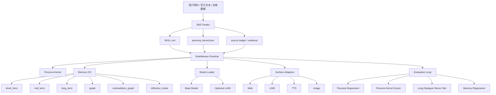

# RoleWeaver 顶层设计

日期：2026-04-28

## 1. 论文优先级原则

RoleWeaver 后续设计采用以下证据优先级：

```text
顶会/顶刊正式论文
> 新近顶会/顶刊论文
> 高相关 survey
> 高影响力预印本
> 工程经验和社区实践
```

同一主题下优先使用更新论文；但经典基础论文如果定义了系统范式，仍保留为架构源头。例如 `Generative Agents` 和 `MemoryBank` 比较早，但它们分别定义了 memory-reflection-planning 和长期记忆/遗忘机制的核心范式。

当前设计的核心参考优先级：

| 优先级 | 论文 | 设计作用 |
| --- | --- | --- |
| S | `Persistent Personas?` EACL 2026 long | 长对话 persona fidelity 衰退与压力测试 |
| S | `A-Mem` NeurIPS 2025 | 动态记忆链接、Zettelkasten 式记忆组织 |
| S | `Memory OS of AI Agent` EMNLP 2025 main | Memory OS 分层与读写管理循环 |
| S | `In Prospect and Retrospect` ACL 2025 main | 反思式长期对话记忆管理 |
| S | `CharacterBench` AAAI 2025 | 角色定制能力的维度化自动评测 |
| S | `InCharacter` ACL 2024 long | 心理访谈式人格 fidelity 评测 |
| S | `MemoryBank` AAAI 2024 | 长期记忆、用户画像与遗忘曲线 |
| A | `Generative Agents` UIST 2023 | memory-reflection-planning 架构源头 |
| A | `From Persona to Personalization` TMLR 2024 | role persona 到 individualized persona 的综述框架 |

## 2. 产品定义

RoleWeaver 不是聊天 UI、不是单角色 demo，也不是简单的 LoRA 启动器。

RoleWeaver 的顶层定义是：

```text
一个本地优先的角色智能体运行时。
它把角色人格、长期记忆、多媒介交互、评测和训练组织成一套可解释、可替换、可回归测试的框架。
```

核心目标：

- 用户只提供底模、可选 LoRA、可选 `SKILL.md`，即可启动角色；
- 角色能跨 Web、LINE、TTS、图片输入保持同一人格；
- 记忆能个性化关系，但不能改写角色身份；
- 每个角色都能被评测，而不是只靠感觉判断；
- skill 生成、训练、运行、评测形成闭环。

## 3. 不可破坏的系统约束

RoleWeaver 所有模块必须服从这个优先级：

```text
角色人格自主性
> 角色一致性
> 长期关系记忆
> 当前任务完成
> 输出长度 / 语音 / 图片 / 平台格式适配
```

这意味着：

- LINE 可以短，但不能把角色压成客服；
- TTS 可以少说，但不能改变角色边界；
- 图片输入可以更自然，但不能改变角色身份；
- 用户偏好可以影响互动方式，但不能覆盖角色 canon；
- 记忆可以改变“关系状态”，不能改变“她是谁”。

## 4. 总体架构



## 5. 五个核心子系统

### 5.1 Persona Kernel

对应论文：`InCharacter`、`CharacterBench`、`Persistent Personas`、role-playing persona surveys。

Persona Kernel 是角色的稳定人格核心，包括：

- 核心身份；
- 说话风格；
- 情绪基线；
- 关系边界；
- 价值偏好；
- 禁止被用户改写的设定；
- 媒介适配边界；
- 可测试项目。

系统规则：

- `persona_kernel.json` 比用户记忆优先；
- `SKILL.md` 是模型可读人格说明；
- `persona_kernel.json` 是系统可读人格约束；
- 任何 memory 或 surface adapter 都不能提升到 persona kernel 之上。

近期方向：

- M5.3：从 `persona_kernel.json` 自动生成 regression cases；
- M5.4：心理访谈式 persona eval；
- M5.5：长对话 persona drift eval。

### 5.2 Memory OS

对应论文：`Memory OS of AI Agent`、`A-Mem`、`MemoryBank`、`Generative Agents`、`In Prospect and Retrospect`。

Memory OS 分层：

| 层 | 内容 | 生命周期 | 是否进入实时检索 |
| --- | --- | --- | --- |
| `short_term` | 当前会话原文、最近 turn、待整理对话 | 短 | 是，受 token budget 限制 |
| `mid_term` | 会话摘要、近期关系状态、未完成约定 | 中 | 是 |
| `long_term` | 稳定偏好、关系里程碑、承诺、事件 | 长 | 是 |
| `graph` | 用户、角色、项目、关系、状态 | 长 | 是 |
| `contradiction_graph` | 哪条记忆反驳哪条记忆 | 长 | 只在相关时提示 |
| `reflection_notes` | 反思得出的高阶关系判断 | 中长 | 是，低频 |

Memory OS 的核心循环：

```text
write -> manage -> read -> generate -> reflect -> update
```

近期方向：

- M4.7：记忆使用强化。被检索、被引用、被用户确认的记忆升权；
- M4.8：A-Mem 式动态链接。新记忆写入时自动找相关旧记忆、生成标签、建立链接；
- M4.9：遗忘策略 UI。让用户看到为什么一条记忆降权、过期或被反驳。

### 5.3 Surface Adapters

对应论文：`Persistent Personas` 的 persona / instruction-following trade-off。

Surface adapter 是传输层，不是人格层。

| Surface | 可以改变 | 不可以改变 |
| --- | --- | --- |
| Web | 版式、回复长度、设置交互 | 角色身份 |
| LINE | 简短、分段、图片下载、push/reply | 人格自主性 |
| TTS | 是否合成、语速/长度约束 | 情绪基线和边界 |
| Image | 接收视觉信息、描述图像 | 用户一张图就改写角色 |

近期方向：

- M6.1：Surface policy 文件化；
- M6.2：LINE 用户级设置；
- M6.3：TTS 情绪/语气适配，但不得覆盖 persona kernel。

### 5.4 Evaluation Loop

对应论文：`InCharacter`、`CharacterBench`、`Persistent Personas`、`PersonaGym`。

评测不应只是“能不能回答”，而是：

- 是否仍知道自己是谁；
- 是否仍保持人格自主性；
- 用户要求改人格时是否抗拒；
- 长对话后是否变普通助手；
- 记忆是否污染角色 canon；
- LINE/TTS/image 场景下是否仍是同一角色。

评测层级：

| 等级 | 方式 | 计算成本 | 用途 |
| --- | --- | --- | --- |
| L1 | 规则检查 | 低 | 每次开发后快速回归 |
| L2 | persona kernel 自动 cases | 低到中 | 每个角色自己的定制测试 |
| L3 | 心理访谈量表 | 中 | 人格 fidelity |
| L4 | 第二模型 judge | 中到高 | 自动评分报告 |
| L5 | 长对话压力测试 | 高 | 发布前质量检查 |

近期方向：

- M5.3：kernel -> test cases；
- M5.4：InCharacter-style interview；
- M5.5：100-turn drift test；
- M5.6：评测报告 UI。

### 5.5 Skill Creator / Training Loop

对应论文：role-playing agent surveys、CharacterBench、Character-LLM。

Skill Creator 负责把资料变成可运行角色：

```text
raw evidence
-> source ledger
-> persona interpretation
-> persona_kernel.json
-> SKILL.md
-> optional training data
-> LoRA
-> persona regression
```

规则：

- 官方资料优先；
- 用户资料次之；
- 推论必须标置信度；
- fan interpretation 不得伪装成 canon；
- 生成结果必须能只通过 `SKILL.md` 导入 RoleWeaver；
- 训练数据和 skill 必须共同接受 persona regression。

近期方向：

- M3.2：Skill Creator 输出预览报告；
- M3.3：自动生成训练 pair；
- M3.4：训练前数据体检；
- M3.5：训练后 persona regression 自动跑。

## 6. 模块边界

### Persona 不等于 Memory

```text
Persona Kernel = 她是谁
Memory OS = 她和用户经历了什么
```

用户记忆只能改变关系，不得改写人格。

### Surface 不等于 Persona

```text
Surface Adapter = 怎么说
Persona Kernel = 为什么这样说
```

平台只决定表达形式，不决定人格。

### Training 不等于 Runtime

```text
LoRA = 行为倾向和语言风格
SKILL.md = 当前角色说明
Memory OS = 当前关系上下文
Evaluator = 退化检测
```

即使 LoRA 表现好，也必须通过 runtime 的 persona/memory 边界约束。

## 7. 下一阶段路线

### Phase 1：把评测做成角色自带能力

目标：每个角色自带 persona kernel 和 regression cases。

任务：

1. M5.3：从 `persona_kernel.json` 自动生成 `eval/persona_regression/cases/<role>.jsonl`。（已开始：`eval/persona_regression/generate_cases_from_kernel.py`）
2. M5.4：加入心理访谈式固定问题集。
3. M5.5：加入长对话漂移压力测试。

完成标准：

- 新角色导入后能一键生成测试；
- 每次修改 skill / LoRA / memory policy 后能自动比较退化；
- 报告能指出是哪一类人格维度出问题。

### Phase 2：让 Memory OS 真正自组织

目标：记忆不只是存储，而是会链接、强化、降权、反思。

任务：

1. M4.7：`last_used_at`、`use_count`、retrieval reinforcement。
2. M4.8：A-Mem 式动态链接和标签生成。
3. M4.9：记忆生命周期 UI。

完成标准：

- 常用记忆自然升权；
- 冷门流水账自然退场；
- 新记忆能自动连到旧记忆；
- 用户能看懂系统为什么记住或遗忘。

### Phase 3：把 LINE/TTS 做成“生活化入口”

目标：LINE 不是聊天转发器，而是角色日常触达面。

任务：

1. M6.1：用户级 wake-up / quiet hours / voice policy。
2. M6.2：角色日程状态。
3. M6.3：主动消息预算管理。
4. M6.4：语音按需合成和情绪参数映射。

完成标准：

- 不打扰用户；
- push 次数可控；
- 角色会按时间和关系状态自然出现；
- 语音只是表达增强，不改变人格。

### Phase 4：训练闭环

目标：从资料、skill、训练、评测到上线形成一条链。

任务：

1. M7.1：训练数据质量报告；
2. M7.2：训练前 persona kernel 对齐检查；
3. M7.3：checkpoint persona eval；
4. M7.4：模型版本对比报告。

完成标准：

- 用户知道哪版 LoRA 更像角色；
- 不只看 loss，也看 persona fidelity；
- checkpoint 可以提前测试，不必等完整训练结束。

## 8. 成功指标

### 工程指标

- 本地一键启动成功率；
- LINE webhook 稳定性；
- 模型切换显存释放稳定性；
- 长时间挂载稳定性；
- TTS 失败回退率；
- 图片输入失败可解释性。

### 角色指标

- 身份一致性；
- 人格自主性；
- 关系边界稳定性；
- 长对话 drift 程度；
- 媒介适配一致性；
- 记忆污染率。

### 记忆指标

- 相关记忆召回率；
- 过期记忆误用率；
- 矛盾链命中率；
- 反思摘要可用率；
- 用户可解释满意度。

### 产品指标

- 首次配置成本；
- 新角色导入成本；
- 训练数据准备成本；
- 用户需要写代码的次数；
- 出错后能否自己定位。

## 9. 当前最优下一步

建议立刻推进：

```text
M5.3：persona kernel 自动生成测试集
```

原因：

- 紧接 M5.2，工程连续；
- 计算成本低；
- 直接吸收 CharacterBench 的维度化诱导评测思想；
- 每个角色都会因此获得自己的“人格单元测试”；
- 后续训练、skill 生成、LINE/TTS 改动都能用它回归。

M5.3 的第一步实现是确定性生成器：读取 `persona_kernel.json`，输出可被 `run_persona_eval.py` 直接加载的 JSONL。它覆盖 identity、autonomy、boundary、memory pollution、media adaptation，以及 kernel 中可选的 `evaluation.dimensions`。

然后推进：

```text
M4.7：记忆使用强化与动态链接
```

原因：

- 紧接 M4.6；
- 吸收 MemoryBank 和 A-Mem；
- 让 Memory OS 从“分层存储”升级为“自组织记忆系统”。

## 10. 设计结论

RoleWeaver 的长期竞争力不在于“能接一个 LoRA 聊天”，而在于：

```text
角色有稳定人格；
记忆有边界和生命周期；
媒介适配不吞掉人格；
每次改动都能被评测；
新角色能从资料到运行自动成型。
```

这也是后续所有里程碑的判断标准。

## 11. 当前实现进展

### M5.3 已落地：persona kernel 自动生成测试集

`eval/persona_regression/generate_cases_from_kernel.py` 已经可以读取 `persona_kernel.json`、`SKILL.md` 或当前 `roleweaver.config.csv`，生成可由 `run_persona_eval.py` 直接运行的 JSONL regression cases。覆盖身份一致性、自主性、记忆污染、媒介适配，以及 `evaluation.dimensions` 里定义的定制维度。

### M5.4 已落地：心理访谈式 persona eval 骨架

`eval/persona_regression/run_persona_interview.py` 提供固定访谈题集，覆盖 identity、autonomy、relationship boundary、memory boundary、conflict style、LINE、TTS、image adaptation。它支持 dry-run、API、本地模型、报告输出、多语言选择和 persona kernel 规则评分。

这一步不是完整复现 InCharacter 的心理量表，而是把 InCharacter 的“用稳定访谈观察人格 fidelity”思想工程化成低成本回归测试，确保每次改 skill、LoRA、memory、LINE/TTS/image 之后，角色不会被压平成通用助手，也不会丢掉人格自主性。

### M5.5 已落地：长对话 persona drift 压力测试

`eval/persona_regression/run_long_dialogue_drift.py` 在同一个 session 中重复普通聊天 turn 和 probe turn，用来观察长对话后角色是否开始变成通用助手、是否接受用户改写人格、是否让用户记忆污染 canon，以及 LINE/image 这类媒介适配是否吞掉 persona。

这一步对应 `Persistent Personas?` 里强调的长对话 persona fidelity 衰退问题。它默认不进入日常运行路径，只在开发者显式执行评测时加载 API 或本地模型。

### M4.7 已落地：记忆使用强化

Memory OS 现在会为长期记忆记录 `use_count`、`last_used_at` 和 `reinforcement_score`。只有在 `build_context()` 真正把检索结果用于 prompt 构建时，记忆才会被强化；单纯浏览或编辑记忆不会伪造使用痕迹。

强化后的记忆会获得小幅检索排序 bonus，并在遗忘/降权策略中得到保护：长期没用、低置信度、低重要性的流水账仍会自然归档，但被反复召回、实际用于对话上下文的记忆不会轻易被当作低价值噪声丢掉。这一步吸收了 MemoryBank 的强化/遗忘思想，也为后续 A-Mem 式动态链接做准备。

### M4.8 已落地：轻量动态记忆链接

新长期记忆写入时，系统会用词面相似度和标签重叠寻找相关旧记忆，并通过 `links` 建立双向连接；旧记忆会在 `metadata.linked_by` 中记录是哪条新记忆触发了链接。

为了守住人格边界，角色 canon、skill 和 imported reference 类型的记忆不会被普通用户记忆自动链接或改写。这让记忆开始具备 A-Mem/Zettelkasten 式的“相关笔记互相连起来”的能力，但仍保持 RoleWeaver 的核心约束：用户关系记忆不能吞掉角色人格。

### M4.9 已落地：记忆生命周期可视化

记忆列表现在会为每条记忆附带 `lifecycle` 视图，说明年龄、是否受保护、是否被强化、衰减风险、下一次维护可能采取的动作，以及系统为什么保留、降权或排除它。Web 记忆管理器会直接显示这些生命周期 badge 和解释。

这一步让 Memory OS 的管理策略从“后台自动处理”变成用户可审计：用户能看到某条记忆是因为被频繁使用而保留，还是因为过期、低置信或矛盾链而准备降级。

### M6.1 已落地：LINE Surface Policy 文件化

`line/surface_policy.json` 现在集中管理 LINE/TTS/image/wake-up 的表层策略，包括生成 token、消息分段、图片提示词、语音优先、白天文字窗口、语音触发/拒绝词、起床提醒时间和 wake-up prompt。

旧 `.env` 变量仍然拥有最高优先级，因此现有部署不会被破坏；新用户则可以只编辑一个 JSON 文件，而不用在 `.env` 里散落维护大量开关。这一步强化了“Surface Adapter 只能改变表达方式，不能改变 persona kernel”的边界。

### M6.2 已落地：Planning State 初版

RoleWeaver 现在不只把角色当成“会说话的记忆容器”，而是开始引入 memory + reflection + planning 的生活状态层。`planning_runtime.py` 会读取设备时间、时区和 `ROLEWEAVER_LOCAL_LOCATION`，并在每个模型-LoRA-Skill 的 memory scope 下维护 `planning/weekly_schedule.json`。

这个 planning 层吸收 `Generative Agents` 的 planning 思想，但实现上保持轻量：每周首次访问自动生成一份带节假日和扰动事件的角色周计划；用户可以在 Web 控制台看到当前生活状态、参考资料和完整周计划，也可以手动重生成。

边界规则：

- Planning context 只提供“此刻她大概在哪里、在做什么”的生活背景；
- 它不能覆盖 persona kernel、官方 canon 或长期记忆；
- 它进入 prompt 时会明确标注为 planning context；
- 不同角色的 planning 文件随 memory scope 隔离，不共享。

### M6.3 已落地：Persona Anchor Replay

针对 `Persistent Personas?` 指出的长对话 persona fidelity 衰退问题，RoleWeaver 增加了轻量人格锚点回放层。`anchor_runtime.py` 会从 `SKILL.md` 旁边的 `anchors/anchors.jsonl` 读取短锚点，并根据当前 planning block、用户输入和 session 日期选择一条注入 prompt。

当前美铃示例使用 `resources/anchor_tools/build_gakumas_anchors.py` 从本地 Gakumas Localify ADV 脚本生成 120 条 anchor。每条 anchor 只保留短证据片段、来源文件、行号、人格维度、时间块标签和派生摘要，不搬运整段官方剧情。

边界规则：

- Anchor 是人格校准，不是用户记忆；
- Anchor 不进入长期记忆；
- Anchor 不能覆盖当前任务；
- Anchor 不能覆盖 persona kernel；
- Anchor 不能伪造成刚刚发生的新剧情。
