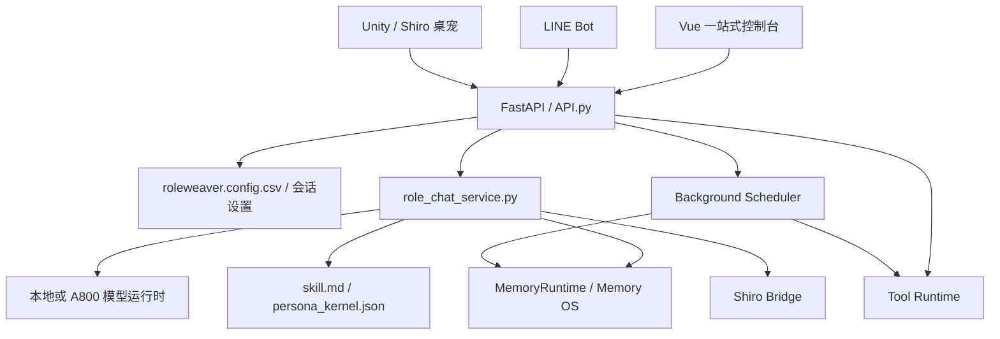

# RoleWeaver 系统设计与详细方案

更新时间：2026-05-01

## 1. 项目定位

RoleWeaver 是角色型长期陪伴智能体的运行底座。它负责把底模、LoRA、skill、记忆、工具、前端、LINE、TTS、远端 A800 服务和 Shiro 认知层统一到一个可启动、可配置、可观察的本地系统里。

它不直接等同于“人格本身”。RoleWeaver 的边界是：

- 提供稳定的模型服务和多端入口；
- 管理角色会话、记忆目录、配置快照和运行状态；
- 提供 Memory OS、反思、矛盾链、遗忘、锚点、工具调用等基础设施；
- 与 `Roleweaver.skill` 读取角色定义，与 `shiro` 读取更高层认知状态。

## 2. 顶层架构

## 3. 核心模块

### 3.1 配置与会话

- 全局配置入口：`roleweaver.config.csv`。
- 每个会话保存独立 `session_config.json`，恢复旧会话时读取当时模型、LoRA、skill、语言、量化和记忆路径。
- 记忆目录按 `模型 + LoRA + skill` 指纹隔离，同一配置下的多个会话再按时间或会话 ID 分层。
- 用户可见名称和内部会话目录分离，避免改名导致目录错配。

### 3.2 模型运行时

- 本地模式：适合 4B/9B 文本模型、LoRA 调试和轻量角色聊天。
- 远端模式：A800 运行 Qwen3-Omni 等重模型，本地通过 SSH 隧道或 HTTP 访问。
- LoRA 可选：空值时直接加载底模。
- 量化可配置：本地默认 4bit；A800 默认 bf16，不做不必要量化。
- 多模态入口：文本稳定优先，图片已走 vision/omni 分支；音频/视频后续统一到 Shiro 多模态感知层。

### 3.3 Memory OS

当前 Memory OS 包含：

- short-term：当前会话原文与上下文窗口；
- mid-term：会话摘要、近期状态、反思笔记；
- long-term：长期偏好、事件、承诺、关系判断；
- graph：人物、关系、项目、状态；
- contradiction graph：矛盾链；
- reflection notes：系统反思出的高阶关系判断；
- A-Mem style evolution：新记忆触发旧记忆表征更新。

实时聊天只做轻量检索、写入和上下文预算控制。反思、整理、遗忘、锚点抽取、主动学习等重任务交给退出、手动整理、夜间或空闲调度。

### 3.4 工具层

工具调用不直接使用裸 ReAct，而是采用 Shiro/RoleWeaver 共享的意图层：

- tool desire：想调用什么；
- tool risk：是否需要用户确认；
- external action guard：对外通信、写文件、发消息必须可控；
- outcome memory：工具结果如何进入记忆。

首批工具包括运行状态、配置读取、记忆检索、记忆整理、PDF 读取、网络搜索、训练状态、LINE/TTS/SSH 状态。

### 3.5 前端与外部入口

- Vue 控制台：聊天、设置、记忆、工具、LINE、训练、Shiro 状态、临时公网地址说明。
- LINE Bot：文本、图片、可选语音回复、定时 push。
- Unity Client：作为 Shiro 桌宠/3D 前端，显示状态、情绪、对话与远端模型连接。
- TTS：GPT-SoVITS 本地服务，本地声纹合成与远端 LLM 分离。

## 4. 详细方案

### M1 运行稳定性

- 启动时直接预加载模型，避免第一次对话冷启动超时。
- 同一配置复用 snapshot service，不重复加载模型。
- API、LINE、Unity 三端共享同一个后端服务。
- 增加 `/health`、`/status`、`/tools/actions` 等可观测接口。

### M2 配置与部署

- 提供本地一键启动、A800 服务包、SSH 隧道配置、LINE 配置、TTS 配置。
- 所有敏感信息进入 `.local.csv` 或 `.env`，默认不进 Git。
- 前端允许修改模型路径、LoRA、skill、语言、量化、LINE token、SSH 主机端口。

### M3 角色与 skill

- 支持单文件 `skill.md` 直接加载。
- 支持 `persona_kernel.json` 做角色核检查。
- 支持角色锚点：官方/人工/半自动对话事件，定期注入但不覆盖真实互动。

### M4 记忆系统

- 已有写入、检索、编辑、矛盾链、自动矛盾检测、反思整理、遗忘与有效期、A-Mem 旧记忆演化。
- 下一步接公开 benchmark adapter，形成可复现实验。
- 建议把实时路径和离线路径彻底分开：实时只检索，离线才重写/归档/反思。

### M5 评测

- persona regression：身份、边界、长对话漂移、媒介适配、记忆污染。
- memory benchmark：内部 smoke benchmark + 公开 LongMemEval/LoCoMo/MemoryAgentBench/PERMA 适配。
- companion evaluation：自我连续性、关系连续性、自主性、情绪行为一致性、长期漂移和依赖风险。

### M6 Shiro Bridge

- RoleWeaver 读取 Shiro thought context；
- 聊天后把输入/输出作为 stimulus 写回 Shiro；
- 前端和 Unity 显示 Shiro 当前认知、情绪、计划、学习状态；
- 但 RoleWeaver 不拥有 Shiro 的人格核心，保持项目分离。

## 5. 论文级目标

RoleWeaver 的研究价值不在“一个更强 RAG”，而在组合：

1. MemoryOS 分层存储；
2. A-Mem 式旧记忆演化；
3. 矛盾链与遗忘感知；
4. 角色锚点与 persona regression；
5. 工具结果进入记忆的可控路径。

论文级实验最低要求：

- 在 LongMemEval、LoCoMo、MemoryAgentBench/MemBench 至少两个公开基准上跑完整结果；
- 与 raw dialogue RAG、recency、long-context、MemGPT/MemoryOS-like、MemoryBank-like、A-Mem-like 做对照；
- 做消融：无反思、无矛盾链、无遗忘、无 A-Mem 演化、无 persona anchor；
- 报告显著性、token 成本、延迟、存储增长和错误类型。

