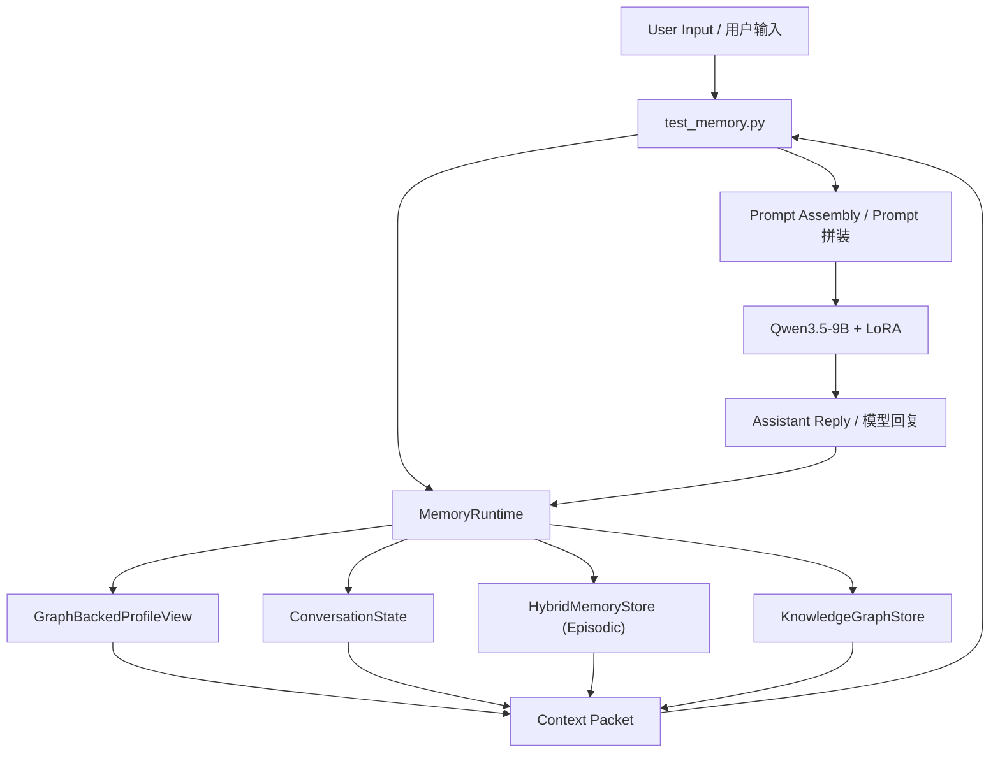

# 记忆系统设计文档 / Memory System Design Document

文档日期 / Date: 2026-04-24  
项目目录 / Project Root: `C:\Users\kator\Desktop\HMSZ`

## 1. 文档目的 / Purpose

中文：  
本文档描述当前项目中“秦谷美铃本地复刻方案”的记忆系统设计，包括系统目标、模块划分、数据流、存储结构、检索策略、知识图谱设计、运行时注入方式，以及后续扩展方向。本文档既用于当前实现说明，也作为后续继续演进记忆模块的基线。

English:  
This document describes the memory system design for the current local Misuzu Hataya replica project, including goals, architecture, data flow, storage layout, retrieval strategy, knowledge graph design, runtime prompt injection, and future extension directions. It serves both as implementation documentation and as a baseline for future iteration.

## 2. 背景 / Background

中文：  
当前项目已经完成本地模型推理、角色风格 LoRA、基础对话入口和记忆系统重构。新的记忆系统核心代码位于 [memory_runtime.py](C:/Users/kator/Desktop/HMSZ/memory_runtime.py:1)，推理入口位于 [test_memory.py](C:/Users/kator/Desktop/HMSZ/test_memory.py:1)。  
在重构之前，系统只有：

- 一个最近几轮对话窗口
- 一个基于 FAISS 的长期记忆桶

这导致系统虽然“能记”，但记忆没有分层，也没有画像、摘要、知识图谱和更稳的两阶段检索与精排机制。

English:  
The project already supports local model inference, role-style LoRA, a basic chat entrypoint, and a refactored memory runtime. The new memory core lives in [memory_runtime.py](C:/Users/kator/Desktop/HMSZ/memory_runtime.py:1), while the inference entry is [test_memory.py](C:/Users/kator/Desktop/HMSZ/test_memory.py:1).  
Before the refactor, the system only had:

- a short recent chat window
- one FAISS-based long-term memory bucket

As a result, the system could “remember” in a loose sense, but lacked layering, user profile modeling, summarization, knowledge graph support, and a robust two-stage retrieval and reranking pipeline.

## 3. 设计目标 / Design Goals

中文：

- 支持 `working memory / episodic memory / semantic graph / character knowledge` 的清晰分层
- 将“记忆存储”和“推理入口”解耦，便于后续替换实现
- 保持本地可运行，不依赖在线服务
- 优先保证可解释、可调试、可回归测试
- 为后续更强的 RAG、rerank、LLM 提取器和图谱扩展预留接口

English:

- Support a clearer structure of `working memory / episodic memory / semantic graph / character knowledge`
- Decouple memory storage/runtime logic from the model inference entrypoint
- Keep the system fully local and runnable without online services
- Prioritize interpretability, debuggability, and regression testing
- Leave room for stronger future upgrades such as richer RAG, reranking, LLM-based extraction, and graph expansion

## 4. 非目标 / Non-Goals

中文：

- 本系统当前不追求“真实认知型长期记忆”，它仍然是运行时注入而不是参数内化
- 当前不解决多用户隔离与权限管理
- 当前不做复杂的事实冲突消解和时间版本治理
- 当前不依赖外部数据库或图数据库

English:

- The current system does not aim to provide true cognitively persistent memory; it is still runtime-injected rather than parametric memory
- Multi-user isolation and permission control are out of scope for now
- Complex fact conflict resolution and temporal versioning are not handled yet
- The system does not depend on external databases or graph databases at this stage

## 5. 总体架构 / High-Level Architecture

中文：  
系统的核心思想是：以 `KnowledgeGraphStore` 作为稳定事实真源，以 `HybridMemoryStore` 作为情节记忆真源，以 `ConversationState` 维护 working memory 和摘要缓冲，再由 `GraphBackedProfileView` 把图上的用户事实投影成可注入 prompt 的画像视图。

English:  
The central idea is: use `KnowledgeGraphStore` as the source of truth for stable facts, `HybridMemoryStore` as the source of truth for episodic memory, `ConversationState` for working memory and summary buffering, and `GraphBackedProfileView` as a projection layer that turns graph facts into a prompt-friendly user profile view.

## 6. 模块划分 / Module Breakdown

### 6.1 MemoryRuntime

位置 / Location: [memory_runtime.py](C:/Users/kator/Desktop/HMSZ/memory_runtime.py:768)

中文：  
这是顶层编排器，负责：

- 管理 working memory、episodic memory、graph-backed semantic memory 和 character knowledge
- 根据当前 query 构造注入上下文
- 在每轮对话后协调写回
- 提供 `/mem`、`/profile`、`/summary`、`/kg`、`/ctx` 等调试命令

English:  
This is the top-level orchestrator. It is responsible for:

- managing the five subsystems: short-term, long-term, profile, summaries, and knowledge graph
- building the injected context for the current query
- coordinating write-back after each conversation turn
- exposing debugging commands such as `/mem`, `/profile`, `/summary`, `/kg`, and `/ctx`

### 6.2 HybridMemoryStore

位置 / Location: [memory_runtime.py](C:/Users/kator/Desktop/HMSZ/memory_runtime.py:298)

中文：  
长期记忆存储层，支持：

- JSON 持久化
- `Embedding + FAISS` 粗召回
- `BGE-Reranker` 候选精排
- embedding 或 FAISS 不可用时降级为词面检索 / 内存矩阵检索
- 基于 dense score、lexical score、importance、recency 和 reranker score 的综合排序

English:  
This is the long-term memory storage layer, supporting:

- JSON persistence
- `Embedding + FAISS` coarse retrieval
- `BGE-Reranker` candidate reranking
- graceful fallback to lexical retrieval / in-memory matrix retrieval if embedding or FAISS is unavailable
- combined ranking based on dense score, lexical score, importance, recency, and reranker score

### 6.3 GraphBackedProfileView

位置 / Location: [memory_runtime.py](C:/Users/kator/Desktop/HMSZ/memory_runtime.py:507)

中文：  
这是图谱上的“用户画像投影视图”，不再单独持久化 profile 真源。它的职责是：

- 从用户输入中抽取画像候选
- 将稳定事实写入 `KnowledgeGraphStore`
- 按 slot 聚合图谱事实
- 生成 prompt 注入时可直接使用的画像文本

English:  
This is the graph-backed user profile projection layer rather than a standalone source of truth. It is responsible for:

- extracting candidate user profile facts from input
- writing stable facts into `KnowledgeGraphStore`
- grouping graph facts by slot
- rendering a prompt-friendly user profile view

### 6.4 ConversationState

位置 / Location: [memory_runtime.py](C:/Users/kator/Desktop/HMSZ/memory_runtime.py:580)

中文：  
working memory 与摘要缓冲层，负责：

- 维护最近对话窗口
- 当窗口溢出时将旧消息压缩成摘要
- 摘要本身属于 episodic memory，会同步归档进 `HybridMemoryStore`

English:  
This is the working-memory and summary-buffer layer. It:

- maintains the recent conversation window
- compresses older messages into summaries when the window overflows
- keeps summary state locally while archiving summary outputs into episodic memory

### 6.5 KnowledgeGraphStore

位置 / Location: [memory_runtime.py](C:/Users/kator/Desktop/HMSZ/memory_runtime.py:673)

中文：  
知识图谱层当前是一个轻量三元组集合，负责：

- 预置秦谷美铃的基础公开资料和角色理解锚点
- 在对话中增量写入用户相关事实
- 提供简单检索和核心事实兜底

English:  
The knowledge graph layer is currently a lightweight triple store. It:

- seeds core public Misuzu facts and character-understanding anchors
- incrementally adds user-related facts during conversation
- supports simple search and core-fact fallback

## 7. 数据分层 / Memory Layers

### 7.1 短期记忆 / Short-Term Memory

中文：  
短期记忆保存最近若干条 user/assistant 消息，用于维持当前对话连续性。它不是长期事实库，而是“当前上下文窗口”。

English:  
Short-term memory stores the most recent user/assistant messages to preserve conversational continuity. It is not a long-term fact store; it is the current interaction window.

### 7.2 用户画像 / User Profile

中文：  
用户画像不再是独立存储层，而是知识图谱上 `制作人` 节点相关事实的一个投影视图。它的目标不是单独存文件，而是把稳定事实从图谱中提取成模型可消费的画像摘要。

English:  
The user profile is no longer a standalone storage layer. It is now a projection view over the `Producer`-related facts in the knowledge graph, turning stable graph facts into a compact persona summary the model can consume.

### 7.3 情节记忆 / Episodic Memory

中文：  
情节记忆是文本记忆池，主要存储会话事件与过程材料，例如：

- 显式记忆
- 项目上下文
- 摘要归档

English:  
Episodic memory is the text memory pool that mainly stores conversational events and process materials, such as:

- explicit memory instructions
- project context
- archived summaries

### 7.4 摘要缓冲 / Summary Buffer

中文：  
摘要缓冲用于控制 prompt 长度。它不是独立长期记忆类别，而是 working memory 溢出时的压缩机制；其产物会进入 episodic memory。

English:  
The summary buffer controls prompt length. It is not an independent long-term memory category; instead, it is the compression mechanism used when working memory overflows, and its outputs are archived into episodic memory.

### 7.5 知识图谱 / Knowledge Graph

中文：  
知识图谱主要承担两种职责：

- 为角色本身提供稳定背景知识
- 为用户事实提供结构化关系表达

English:  
The knowledge graph serves two main purposes:

- providing stable background knowledge about the character
- storing structured relations for user facts

## 8. 存储文件 / Storage Files

中文：  
当前设计使用本地文件持久化：

- `memories_v2.json`：情节记忆文本条目
- `memories_v2.faiss`：情节记忆向量索引
- `memory_state_v1.json`：最近对话和摘要状态
- `knowledge_graph_v1.json`：知识图谱三元组

English:  
The current design uses local file persistence:

- `memories_v2.json`: episodic memory entries
- `memories_v2.faiss`: episodic memory vector index
- `memory_state_v1.json`: recent dialogue and summaries
- `knowledge_graph_v1.json`: knowledge graph triples

## 9. 关键数据流 / Key Data Flows

### 9.1 读路径 / Read Path

中文：

1. 用户输入到达 `test_memory.py`
2. `MemoryRuntime.build_context(query)` 被调用
3. 系统分别读取：
   - 图谱投影出的用户画像
   - 摘要缓冲命中
   - episodic memory 召回结果
   - 知识图谱结果或核心事实
4. 这些内容被组装成 `MemoryContextPacket`
5. 上下文块被拼入 system prompt
6. 最近对话窗口一起进入模型输入

English:

1. User input arrives at `test_memory.py`
2. `MemoryRuntime.build_context(query)` is called
3. The system reads:
   - user profile
   - matched summaries
   - retrieved long-term memories
   - knowledge graph results or fallback core facts
4. These are assembled into a `MemoryContextPacket`
5. The packet is appended into the system prompt
6. The recent chat window is included in the model input

### 9.2 写路径 / Write Path

中文：

1. 模型输出生成后，`MemoryRuntime.record_turn(user_text, assistant_text)` 被调用
2. 系统先尝试从用户输入抽取画像
3. 然后更新短期对话窗口
4. 如果窗口溢出，则生成摘要
5. 将显式记忆、项目过程、摘要归档等写入 episodic memory
6. 将新的稳定用户事实写入知识图谱，并由画像视图负责投影展示

English:

1. After the model response is generated, `MemoryRuntime.record_turn(user_text, assistant_text)` is called
2. The system first extracts candidate user profile facts from the user text
3. It then updates the short-term conversation window
4. If the window overflows, a summary is generated
5. Explicit memory, project-process memory, and archived summaries are written into episodic memory
6. New stable user facts are written into the knowledge graph and later projected through the profile view

## 10. 检索与重排策略 / Retrieval and Reranking Strategy

中文：  
当前长期记忆检索采用两阶段策略：

- 第一阶段：使用 `Embedding + FAISS` 做粗召回
- 第二阶段：使用 `BGE-Reranker` 对候选 chunk 做交叉编码精排
- 同时保留 lexical overlap 作为辅助信号
- 最终分数由以下因素综合得到：
  - dense score
  - lexical score
  - importance bonus
  - recency bonus
  - reranker score

这样设计的原因是：Embedding 适合高效粗筛，FAISS 适合大规模向量检索，而 BGE-Reranker 更适合对少量候选做高质量精排。当前系统把三者组合起来，同时保留词面信号和降级路径，以兼顾速度、扩展性和排序质量。

English:  
The current long-term memory retrieval uses a two-stage strategy:

- Stage 1: use `Embedding + FAISS` for coarse retrieval
- Stage 2: use `BGE-Reranker` for cross-encoder reranking over the candidate chunks
- lexical overlap is preserved as an auxiliary signal
- the final score combines:
  - dense score
  - lexical score
  - importance bonus
  - recency bonus
  - reranker score

This design exists because embeddings are efficient for coarse filtering, FAISS is suitable for scalable vector search, and BGE rerankers are better at high-quality reranking over a smaller candidate set. The current system combines all three while keeping lexical signals and fallback paths for robustness.

## 11. Prompt 注入设计 / Prompt Injection Design

中文：  
系统不会把所有记忆原样灌入模型，而是将它们压缩成一个统一上下文块，结构大致如下：

- 用户画像视图
- 情节记忆
- 角色知识

同时在提示词中明确要求：

- 只在相关时自然参考
- 不要逐条复述
- 不要机械背诵

这样做是为了避免模型输出变成“记忆清单复读机”。

English:  
The system does not dump all memory verbatim into the model. Instead, it compresses memory into a unified context block, roughly structured as:

- user profile view
- episodic memory
- character knowledge

The prompt also explicitly instructs the model to:

- use the information only when relevant
- avoid item-by-item repetition
- avoid mechanical recitation

This helps prevent the model from turning into a “memory list repeater.”

## 12. 知识图谱设计 / Knowledge Graph Design

中文：  
当前知识图谱是轻量三元组，不引入外部图数据库。三元组结构为：

- `subject`
- `relation`
- `object`
- `tags`
- `source`
- `confidence`
- `timestamp`

初始 seed 包含两类信息：

- 美铃公开档案
- 美铃人物理解锚点

后续对话中则会增量加入：

- `制作人 - 名字 - 小林`
- `制作人 - 喜欢 - 寿司`

English:  
The current knowledge graph is a lightweight local triple store without an external graph database. Each triple contains:

- `subject`
- `relation`
- `object`
- `tags`
- `source`
- `confidence`
- `timestamp`

The initial seed contains two classes of facts:

- public profile facts about Misuzu
- character-understanding anchors about Misuzu

During later conversations, the system incrementally adds user-related facts such as:

- `Producer - Name - Kobayashi`
- `Producer - Likes - Sushi`

## 13. 调试与可观测性 / Debugging and Observability

中文：  
当前提供如下调试命令：

- `/mem list`
- `/mem search 查询词`
- `/profile show`
- `/summary show`
- `/kg show`
- `/kg search 查询词`
- `/ctx 查询词`

这些命令的作用是让开发者能直接看到“系统究竟记住了什么、检索到了什么、实际注入了什么”。

English:  
The system currently provides the following debugging commands:

- `/mem list`
- `/mem search <query>`
- `/profile show`
- `/summary show`
- `/kg show`
- `/kg search <query>`
- `/ctx <query>`

These commands are meant to make the system inspectable, so a developer can directly see what the system stored, what it retrieved, and what it injected.

## 14. 当前优点 / Current Strengths

中文：

- 结构已经从单桶记忆升级为多层记忆
- 记忆逻辑与推理解耦，便于单独测试
- 具备本地运行与降级能力
- 有基础自动化测试，便于回归
- 已经为后续更强的 RAG 和 KG 扩展留好接口

English:

- The system has evolved from one memory bucket into a layered memory architecture
- Memory logic is decoupled from inference, making isolated testing easier
- It supports local execution and graceful degradation
- Basic automated regression tests already exist
- Interfaces are already in place for stronger future RAG and KG extensions

## 15. 当前限制 / Current Limitations

中文：

- 画像提取仍然是规则驱动，容易漏召回或误提取
- 摘要目前是模板式压缩，不是真正语义摘要
- 知识图谱目前没有复杂冲突治理
- reranker 已接入，但最终融合权重仍是启发式设置，不是任务上专门训练出来的策略
- 还没有验证“模型实际会不会稳定使用这些记忆”

English:

- Profile extraction is still rule-based and may miss facts or extract incorrectly
- Summaries are currently template-based, not true semantic summaries
- The knowledge graph has no advanced conflict resolution yet
- A reranker is integrated, but the final score fusion weights are still heuristic rather than task-trained
- It is not yet fully validated whether the model consistently uses the injected memory at generation time

## 16. 后续演进建议 / Recommended Next Steps

中文：

1. 增加真实推理集成测试，验证模型是否稳定利用记忆
2. 将画像提取从规则升级到 LLM + 规则双通道
3. 给摘要缓冲增加“事件摘要 + 情绪摘要”双视角
4. 继续调优 `Embedding + FAISS + BGE-Reranker` 的融合权重与候选集大小
5. 给知识图谱增加时间、冲突、来源优先级机制
6. 引入用户记忆治理策略，防止噪声污染长期记忆

English:

1. Add real inference integration tests to verify whether the model actually uses memory consistently
2. Upgrade profile extraction from rules to a hybrid LLM-plus-rules pipeline
3. Extend the summary buffer into dual-perspective summaries: event summary and emotional summary
4. Continue tuning the `Embedding + FAISS + BGE-Reranker` fusion weights and candidate pool size
5. Add time, conflict, and source-priority mechanisms to the knowledge graph
6. Introduce memory governance policies to prevent long-term memory pollution

## 17. 结论 / Conclusion

中文：  
当前记忆系统已经完成从“实验性外挂记忆”向“可维护的多层记忆运行时”的第一阶段升级。虽然它还不算最终形态，但架构已经具备继续扩展的基础，特别适合后续往角色陪伴、稳定关系建模和更强的本地 RAG 方向演进。

English:  
The current memory system has completed its first major upgrade from an “experimental external memory add-on” to a “maintainable layered memory runtime.” While it is not yet the final form, the architecture now provides a solid foundation for future expansion, especially toward character companionship, stable relationship modeling, and stronger local RAG capabilities.
